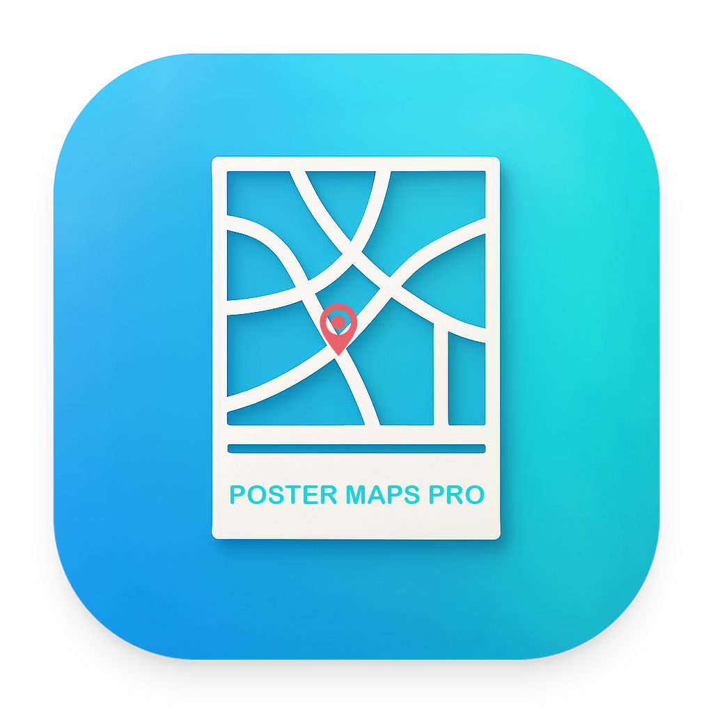

<p align="center">
  
</p>

<h3 align="center">Poster Maps Pro</h3>

<p align="center">
  <strong>Professioneller Karten-Poster-Generator für macOS — Erstellen & Verkaufen Sie wunderschöne Stadtkarten</strong>
</p>

<p align="center">
  <a href="https://apps.apple.com/cn/app/id6759055660"></a>
  <a href="#-systemanforderungen"></a>
  <a href="https://postermapspro.ifama.top/"></a>
  
  <a href="https://twitter.com/intent/tweet?text=Check%20out%20Poster%20Maps%20Pro%20-%20Create%20%26%20Sell%20Beautiful%20City%20Map%20Posters!%20https%3A%2F%2Fgithub.com%2Fpostermapspro%2Fposter-maps-pro"></a>
</p>

<p align="center">
  <a href="README.md">English</a> | <a href="README.zh-CN.md">简体中文</a> | <a href="README.zh-TW.md">繁體中文</a> | <a href="README.ja.md">日本語</a> | <a href="README.it.md">Italiano</a> | <a href="README.fr.md">Français</a> | Deutsch | <a href="README.pt.md">Português</a>
</p>

> ⭐ **Wenn Sie dieses Projekt hilfreich finden, geben Sie ihm bitte einen Stern! Es hilft mehr Menschen, Poster Maps Pro zu entdecken.**

---

## 🎯 Über

Poster Maps Pro ist eine leistungsstarke **macOS-Anwendung**, die jede Stadtkarte in atemberaubende Poster in professioneller Qualität verwandelt. Ob Sie Wandkunst erstellen, digitale Produkte auf Etsy verkaufen oder einen passiven Einkommensstrom aufbauen — dieses Tool macht alles mühelos.

### ✨ Hauptfunktionen

- **🗺️ Sofortige Kartengenerierung** — Geben Sie einen beliebigen Stadtnamen weltweit ein und generieren Sie in Sekunden schöne, anpassbare Karten. Unterstützt über 1.000 visuelle Stile von minimalistisch bis künstlerisch.
- **🎨 Professionelles Poster-Design** — Fügen Sie dekorative Elemente, benutzerdefinierten Text, Titel und Untertitel hinzu. Erstellen Sie einzigartige Wandkunst, bereit für Druck oder digitalen Verkauf.
- **📦 Mehrere Exportformate** — Exportieren Sie hochwertige PNG-Bilder und druckfertige PDF-Dateien. Perfekt für digitale Downloads auf Etsy, Gumroad oder POD-Plattformen.
- **💰 Business-orientiert** — Ideal für Etsy-Verkäufer, digitale Produktentwickler und Side-Hustler. Generieren Sie 50-100+ einzigartige Produkte in einer einzigen Sitzung.
- **🌏 30 Interface-Sprachen** — Vollständige Internationalisierungsunterstützung inklusive Chinesisch, Englisch, Japanisch, Koreanisch, Französisch, Deutsch, Spanisch, Portugiesisch, Arabisch und mehr.

<p align="center">
  
</p>

---

## 🏆 Warum Poster Maps Pro?

**⚡ Geschwindigkeit & Effizienz**
Generieren Sie professionelle Karten-Poster in Minuten, nicht Stunden. Erstellen Sie stapelweise 50-100+ einzigartige Designs in einer einzigen Sitzung. Perfekt zum schnellen Aufbau eines digitalen Produktbestands.

**💼 Business-Fertig**
Speziell für digitale Produktverkäufer konzipiert. Erstellen Sie verkäufliche Inhalte ohne Design-Fähigkeiten. Perfekt für Etsy, Gumroad, Creative Market und POD-Plattformen.

**🎯 Keine Design-Fähigkeiten Erforderlich**
Kein Photoshop, kein Illustrator, keine Design-Erfahrung nötig. Wenn Sie einen Stadtnamen eingeben können, können Sie professionelle Karten-Poster erstellen.

**🌍 Weltmarkt-Fertig**
Erstellen Sie Karten für jede Stadt weltweit. Erschließen Sie internationale Märkte — New York, London, Tokio, Paris und tausende weitere Städte zur Hand.

**🔒 Datenschutz Zuerst**
Die gesamte Verarbeitung erfolgt lokal auf Ihrem Mac. Ihre Designs und Daten verlassen niemals Ihr Gerät. Keine Cloud-Abhängigkeit, keine Internetverbindung für Kernfunktionen erforderlich.

<p align="center">
  
</p>

---

## 🎨 Produkt-Vitrine

<p align="center">
  
  
  
  
</p>

<p align="center">
  
  
  
  
</p>

<p align="center">
  
  
  
  
</p>

<p align="center">
  
  
  
  
</p>

<p align="center">
  
  
  
  
</p>

<p align="center">
  
  
  
  
</p>

<p align="center">
  
  
  
  
</p>

<p align="center">
  
  
  
  
</p>

<p align="center">
  
  
  
  
</p>

---

## 📋 Anwendungsfälle

| Szenario | Wie Poster Maps Pro Hilft |
|----------|---------------------------|
| 💼 **Etsy Digitale Produkte** | Erstellen Sie 50-200 Stadtkarten-Poster, listen Sie sie als digitale Downloads, verdienen Sie passives Einkommen. |
| 🎨 **POD (Print on Demand)** | Generieren Sie Designs für Printful, Printify, Redbubble Wandkunst-Produkte. |
| 💻 **Fiverr/Upwork Dienste** | Bieten Sie benutzerdefinierte Karten-Design-Dienste an, liefern Sie professionelle Ergebnisse schneller. |
| 📦 **Gumroad/Payhip Produkte** | Bündeln Sie Stadtkarten-Sammlungen in verkäufliche digitale Produktpakete. |
| 📱 **Content-Erstellung** | Erstellen Sie visuellen Content für TikTok, Pinterest, Instagram um Traffic zu generieren. |
| 🏠 **Persönliche Projekte** | Entwerfen Sie benutzerdefinierte Karten für Wohnkultur, Geschenke, Hochzeitseinladungen, Events. |

---

## 💡 Wie Menschen Geld Verdienen

### Echte Erfolgsgeschichte: 7 Tage bis zum ersten Etsy-Verkauf

**Tag 1-2: Produkte erstellen**
- 80-100 Karten-Poster generiert (30 Städte × 2-3 Stile jeweils)
- Als hochwertige PDFs exportiert

**Tag 3-4: Etsy-Start**
- 50+ Produkte zu je $3.99-$6.99 gelistet
- SEO-optimierte Titel verwendet: "Stadtname + Map + Printable + Wall Art"

**Tag 5-6: Traffic-Generierung**
- Auf Pinterest gepostet (10-30 Bilder/Tag)
- TikTok-Videos erstellt, die den Erstellungsprozess zeigen

**Tag 7: Erster Verkauf**
- **Ergebnis:** Erste Bestellung aus Etsy-Naturalsuche
- **Schlüsselerkenntnis:** Erfolg kommt von Quantität + SEO, nicht vom Perfektionieren eines einzelnen Produkts

**Schlussfolgerung:** Poster Maps Pro ist nicht nur ein Design-Tool — es ist eine **Produkt-Erstellungsmaschine** für digitale Unternehmer.

---

## 🚀 Wie Es Funktioniert

**① Wählen Sie eine Stadt** — Geben Sie einen beliebigen Stadtnamen weltweit ein (New York, Tokio, Paris, London, etc.)

**② Wählen Sie einen Stil** — Wählen Sie aus über 1.000 Kartenstilen: minimalistisch, vintage, farbenfroh, künstlerisch

**③ Passen Sie an** — Fügen Sie Markierungen hinzu, passen Sie Zoom an, setzen Sie Abmessungen (A4, A3, Quadrat oder benutzerdefiniert)

**④ Entwerfen Sie Ihr Poster** — Fügen Sie dekorative Elemente, Titel, Untertitel und Text hinzu

**⑤ Exportieren** — Speichern Sie als PNG oder PDF, bereit für digitalen Verkauf oder Druck

---

## 📥 Installation

### Mac App Store (Empfohlen)

[](https://apps.apple.com/cn/app/id6759055660)

> **Hinweis:** Suchen Sie nach "Poster Maps Pro" im Mac App Store oder klicken Sie auf den Button oben zum direkten Download.

### Systemanforderungen

| Anforderung | Details |
|-------------|---------|
| **OS** | macOS 12.0 (Monterey) oder neuer |
| **Prozessor** | Apple Silicon (M1 / M2 / M3 / M4) oder Intel Mac |
| **Plattform** | Nur macOS (Windows-Version verfügbar, aber Zahlungssystem nicht vollständig unterstützt) |

---

## 💎 Preise

| Plan | Preis | Ideal Für |
|------|-------|-----------|
| **30 Verwendungen** | 26€ | Vorher testen |
| **3-Monats-Pass** | 103€ | Kurzzeitprojekte |
| **6-Monats-Pass** | 168€ | Business aufbauen |
| **Jahres-Pass** | 258€ | Seriöse Unternehmer |

> **Hinweis:** Preise werden im Mac App Store automatisch in Ihre Landeswährung umgerechnet.

---

## 🎯 Schnellstart-Anleitung

### Schritt 1: Generieren Sie Ihre erste Karte
1. Öffnen Sie Poster Maps Pro
2. Geben Sie einen Stadtnamen ein (z.B. "Berlin", "München", "Hamburg")
3. Klicken Sie "Karte generieren"
4. Wählen Sie aus über 1.000 Stilen

### Schritt 2: Entwerfen Sie Ihr Poster
1. Wechseln Sie zu "Kompositions-Tool"
2. Fügen Sie dekorative Elemente hinzu
3. Geben Sie Titel- und Untertiteltext ein
4. Passen Sie Farben und Positionierung an

### Schritt 3: Exportieren & Verkaufen
1. Exportieren Sie als PNG oder PDF
2. Laden Sie auf Etsy, Gumroad oder Ihre bevorzugte Plattform hoch
3. Setzen Sie den Preis ($3.99-$9.99 empfohlen für digitale Downloads)
4. Fangen Sie an zu verdienen!

### Pro-Tipps für Etsy-Erfolg

✅ **Stapel-Erstellung:** Generieren Sie 50-200 verschiedene Stadtkarten um Suchsichtbarkeit zu maximieren  
✅ **SEO-Titel:** Verwenden Sie das Format "Stadtname + Map + Printable + Wall Art + Digital Download"  
✅ **Qualitätsbilder:** Erstellen Sie Mockup-Bilder die Karten an Wänden zeigen  
✅ **Pinterest-Traffic:** Posten Sie Ihre Karten auf Pinterest mit Etsy-Links  
✅ **TikTok-Content:** Erstellen Sie Videos die den Karten-Generierungsprozess zeigen  

---

## 🌐 Wo Sie Ihre Karten Verkaufen

### 🥇 Top-Plattformen (Direktverkauf)

| Plattform | Was Verkaufen | Preisbereich |
|-----------|---------------|--------------|
| **Etsy** | Stadtkarten-Poster, benutzerdefinierte Karten | $3.99 - $9.99 |
| **Gumroad** | Karten-Sammlungen, Bundles | $15 - $39 |
| **Creative Market** | Design-Templates, Ressourcen | $15 - $39 |
| **Payhip** | Digitale Karten-Pakete | $9 - $29 |

### 🥈 POD-Plattformen (Physische Produkte)

| Plattform | Produkttyp | Potenzial |
|-----------|------------|-----------|
| **Printful** | Poster, Leinwanddrucke | Hohe Marge |
| **Redbubble** | Wandkunst, Poster | Passives Einkommen |
| **Society6** | Kunstdrucke, Deko | Design-orientiert |

### 🥉 Service-Plattformen

| Plattform | Servicetyp | Rate |
|-----------|------------|------|
| **Fiverr** | Benutzerdefiniertes Karten-Design | $15 - $50 pro Bestellung |
| **Upwork** | Karten-Design-Projekte | $25 - $100 pro Projekt |

---

## 🔍 Keywords & SEO

```
Karten-Poster-Generator, Stadtkarten-Ersteller, digitales Produkt-Ersteller,
Etsy digitale Downloads, passives Einkommen Tool, Karten-Design-Software,
druckbare Wandkunst, benutzerdefinierter Karten-Macher, Side-Hustle-Tool,
minimalistische Kartenkunst, Reise-Poster-Ersteller, Karten-Druck-Generator,
digitaler Download-Business, POD-Design-Tool, Kartenkunst-Ersteller,
geografischer Poster-Macher, Stadtkunst-Generator, Standort-Karten-Designer
```

---

## 🎓 Lernressourcen

### Demnächst
- **YouTube-Tutorials:** Schritt-für-Schritt-Anleitungen für Etsy-Erfolg
- **Blog:** Tipps zur digitalen Produkterstellung und passivem Einkommen
- **Community:** Treten Sie anderen Erstellern bei, die Poster Maps Pro nutzen

---

## 🤝 Beitragen

Einen Bug gefunden oder eine Feature-Idee? Wir würden gerne von Ihnen hören!

- **Bug-Reports:** Öffnen Sie ein Issue mit Details zum Problem
- **Feature-Anfragen:** Teilen Sie Ihre Ideen für neue Funktionen
- **Erfolgsgeschichten:** Erzählen Sie uns, wie Sie mit Poster Maps Pro Geld verdienen

---

## 📄 Lizenz

Dieses Projekt ist proprietäre Software. Alle Rechte vorbehalten von Kaifeng Sang.

Für persönlichen und kommerziellen Gebrauch mit gültiger Lizenz. Weiterverbreitung oder Reverse Engineering nicht erlaubt.

---

## 👨‍💻 Über den Entwickler

**Kaifeng Sang** — Unabhängiger Entwickler, der Tools für digitale Unternehmer erstellt.

- **Website:** [https://postermapspro.ifama.top/](https://postermapspro.ifama.top/)
- **App Store:** [Poster Maps Pro](https://apps.apple.com/cn/app/id6759055660)
- **Twitter:** [Poster Maps Pro teilen](https://twitter.com/intent/tweet?text=Check%20out%20Poster%20Maps%20Pro%20-%20Create%20%26%20Sell%20Beautiful%20City%20Map%20Posters!)

---

## 🔒 Datenschutz & Sicherheit

- Die gesamte Kartengenerierung erfolgt lokal auf Ihrem Mac
- Keine Daten an externe Server gesendet
- Keine Internetverbindung für Kernfunktionen erforderlich
- Ihre Designs bleiben privat und sicher

---

<p align="center">
  <strong>Fangen Sie an zu Erstellen. Fangen Sie an zu Verkaufen. Fangen Sie an zu Verdienen.</strong>
</p>

<p align="center">
  <a href="https://apps.apple.com/cn/app/id6759055660"></a>
</p>

<p align="center">
  <sub>© 2026 Poster Maps Pro — Ihre Karte, Ihr Business, Ihr Erfolg</sub>
</p>

<p align="center">
  <sub>⭐ Vergessen Sie nicht, diesem Repo einen Stern zu geben, wenn Sie es nützlich finden!</sub>
</p>
